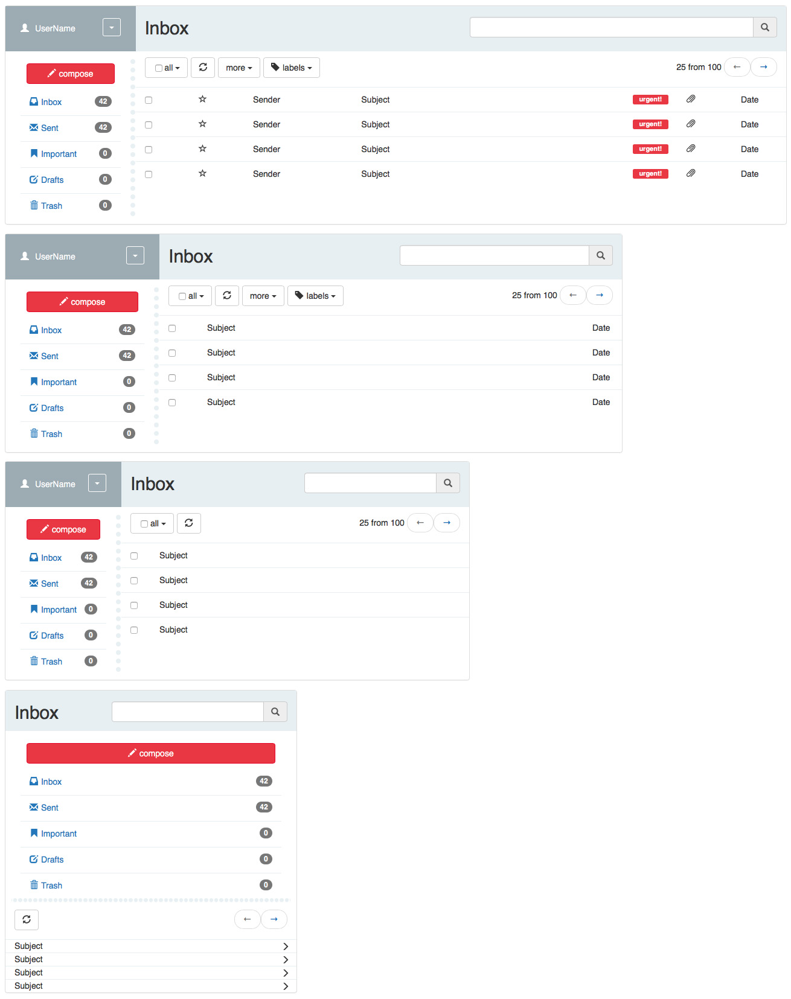

This project was bootstrapped with [Create React App](https://github.com/facebookincubator/create-react-app).
Also this project uses [React-Bootstrap](https://react-bootstrap.github.io/getting-started.html)

It was installed by ***$ npm install react-bootstrap --save*** command

You can see compiled appliction on my AWS account: [https://goo.gl/UlJrRs](https://goo.gl/UlJrRs)

